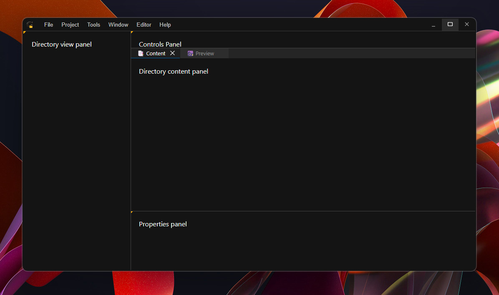

# Gothic Asset Wizard

An all-in-one tool for browsing, editing, previewing and compiling Gothic assets.

> **Note:**  
> This project is still in early development and is not yet ready for use.

Technologies used:
- backend: C++20
- frontend: React using TypeScript

## Preview

## Features

- [ ] Browse VDF files
  - [ ] Seamless integration with regular filesystem content (`_Work` folder)
- [ ] Live preview
  - [ ] Textures
  - [ ] Models
  - [ ] Animations
- [ ] Asset compilation

## Project overview

The `Frontend` folder contains React TS project that handles everything related
to a user interface.

The `Backend` folder contains the C++ code that handles all the heavy lifting
such as parsing VDF files, compiling assets, etc.

### Libraries used

We use a bunch of helper libraries:

- [AppPlatform](https://github.com/UnstableBytes/AppPlatform) - integration of a webview into a C++ application
- [phoenix](https://github.com/GothicKit/phoenix) - managing Gothic assets